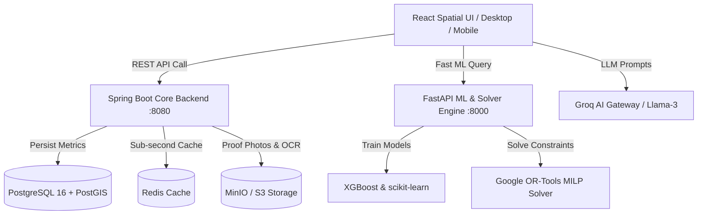

# EcoSphere (VerdantIQ) — Full System Development Roadmap & Status Report

This document outlines the complete architectural roadmap of **EcoSphere (VerdantIQ)** from ideation to production deployment. It details the completed client-side spatial intelligence application and specifies the exact tech stack, microservice layers, database schemas, and ML pipelines required for backend completion.

---

## 1. System Architectural Overview

EcoSphere is a machine learning-driven Environmental Decision Support and Sustainability Intelligence Platform. Unlike static carbon tracking tools, EcoSphere dynamically predicts future resource consumption, simulates virtual household upgrades, optimizes sustainability decisions under financial constraints, and verifies community activities.



---

## 2. Phase 1: Client-Side UI/UX & Spatial Engine — COMPLETED ✅

| Feature / Component | Technology Stack | Status | Description |
| :--- | :--- | :---: | :--- |
| **Design System** | `ui-ux-pro-max-skill` | **DONE** | **Emerald Oasis** Light Mode palette (`#059669` Emerald Mint, `#0F766E` Forest Teal, `#F3F7F5` Fresh Sage White) with Inter typography. |
| **Spatial Canvas Shell** | React 18 + SVG Streams | **DONE** | Fullscreen 2D infinite workspace with drag-to-pan, mouse scroll zoom, zoom controls, and mathematically aligned glowing SVG data pipelines. |
| **Groq AI Floating Omnibar** | React Context + Intent Parser | **DONE** | Central floating command bar with natural language intent recognition ("go to Twin Lab", "log 5 miles walk", "why energy spike?"), quick chips, and audio mic simulation. |
| **Focused Node View** | React + CSS Transitions | **DONE** | Clicking any node card centers it at 115% zoom, dimming non-focused cards (`opacity-20 blur-[2px]`) with header status badges and exit buttons. |
| **View Mode Switcher** | Responsive React Switcher | **DONE** | Seamless 3-mode toggle: 🌐 **Spatial Canvas** (2D grid), 💻 **Desktop App** (Executive sidebar dashboard), and 📱 **Mobile App** (Touch-optimized smartphone interface). |
| **12 Workspace Nodes** | React Components | **DONE** | Onboarding Wizard, Dashboard Hub, Daily Activity Tracker, Predictions & Analytics, Digital Twin Lab, Optimizer, Challenges, Assistant, Community Portal, Settings, Campus Admin, System Telemetry. |
| **Unified API Layer** | `endpoints.js` + `apiService.js` | **DONE** | Modular API service layer connecting client components to Spring Boot, FastAPI, Groq AI, and MinIO S3 endpoints with dual mock/real backend execution modes. |

---

## 3. Phase 2: Backend REST Services (Spring Boot 3.x) — PENDING ⏳

### Target Stack
- **Framework**: Java 21 + Spring Boot 3.2
- **Security**: Spring Security + JWT Authentication
- **Persistence**: Spring Data JPA + Hibernate Spatial (PostGIS)
- **API Specs**: OpenAPI 3.0 / Swagger UI

### Components to Build
1. **Auth & User Management (`/api/v1/auth`, `/api/v1/users`)**:
   - Registration, login, JWT token issuance, RBAC security (`Standard User`, `Institution Admin`, `System Admin`).
2. **Onboarding & Profiling (`/api/v1/onboarding`)**:
   - Baseline calculation algorithms converting household size, diet, and utility bills into baseline CO₂ scores.
3. **Activity Tracker Service (`/api/v1/tracker`)**:
   - CRUD endpoints for resource logs, PostGIS geometry mapping for tree sapling locations, OCR utility bill text extractor.
4. **Community & Institutional Service (`/api/v1/community`, `/api/v1/admin/institution`)**:
   - Multi-tenant data aggregation (`SUM`, `AVG` grouped by institution ID), campus challenge builder, pending submission audit desk.
5. **PDF Statement Generator (`/api/v1/reports`)**:
   - Apache PDFBox service generating formatted executive monthly sustainability statements.

---

## 4. Phase 3: Machine Learning & Optimization Engine (FastAPI) — PENDING ⏳

### Target Stack
- **Framework**: Python 3.11 + FastAPI
- **ML Frameworks**: XGBoost, scikit-learn, Pandas, NumPy
- **Optimization Solver**: Google OR-Tools (Mixed-Integer Linear Programming - MILP)

### Components to Build
1. **Behavioral Forecasting Pipeline (`/api/v1/ml/forecasts`)**:
   - Trains XGBoost regression models on historical energy, water, and transport log series to forecast upcoming 7-day and 30-day consumption curves.
2. **Anomaly Detection & Explainable AI (`/api/v1/ml/explain`)**:
   - Scikit-learn anomaly detection identifying usage spikes (e.g. HVAC thermal draw during heatwaves) and generating structured context prompts.
3. **Google OR-Tools Constraint Engine (`/api/v1/optimizer/solve`)**:
   - Formulates MILP optimization models:
     - **Objective Function**: Minimize CO₂ footprint + Minimize financial cost.
     - **Constraints**: Monthly target budget ($\le B$), minimum carbon offset ($\ge C$), user priority weights.
   - Outputs chronological action roadmap.

---

## 5. Phase 4: Database, Spatial & Object Storage Tier — PENDING ⏳

### Target Stack
- **Relational DB**: PostgreSQL 16 + PostGIS Extension
- **Caching**: Redis 7
- **Object Storage**: MinIO / AWS S3

### Components to Build
1. **PostgreSQL / PostGIS Database Schema**:
   - `users`, `household_twins`, `activity_logs` (with `ST_Point` geometry columns for GPS tracking), `challenges`, `verifications`, `institutions`.
2. **Redis Cache Layer**:
   - Sub-second caching of real-time Eco-Score indices, forecasted usage curves, and leaderboard standings.
3. **MinIO S3 Buckets**:
   - Buckets: `utility-bills`, `challenge-evidence`, `pdf-statements`.

---

## 6. Phase 5: Generative AI & Decision Intelligence — PENDING ⏳

### Target Stack
- **LLM Engine**: Groq API / OpenAI API (Llama-3-70b / GPT-4o-mini)

### Components to Build
1. **System Prompt Templates**:
   - Injects localized user context, weather data, AQI ratings, and digital twin specs into Groq LLM requests for human-readable sustainability advice.
2. **Conversational Assistant Connector**:
   - Chat endpoint returning formatted Markdown tables, micro-charts specs, and quick recommendation chips.

---

## 7. Phase 6: DevOps, Testing & Production Deployment — PENDING ⏳

### Target Stack
- **Containerization**: Docker + Docker Compose
- **Orchestration**: Kubernetes / Helm (Optional for scaling)
- **CI/CD**: GitHub Actions

### Components to Build
1. `docker-compose.yml`:
   - Services: `ecosphere-client`, `spring-boot-backend`, `fastapi-ml`, `postgres-postgis`, `redis`, `minio-s3`.
2. **Automated Verification Suite**:
   - Frontend: Vitest + Cypress E2E.
   - Backend: JUnit 5 + Mockito + pytest.

---

## 8. Development Timeline Summary

```text
[Phase 1: Client Spatial UI & API Service] ────────► COMPLETED ✅ (Current State)
[Phase 2: Spring Boot REST Microservices]  ────────► NEXT UP (Sprint 1)
[Phase 3: FastAPI ML & OR-Tools Solver]   ────────► Sprint 2
[Phase 4: PostgreSQL/PostGIS & Redis DB]   ────────► Sprint 2
[Phase 5: Groq AI LLM Integration]        ────────► Sprint 3
[Phase 6: Docker Compose & Deployment]     ────────► Sprint 4
```
