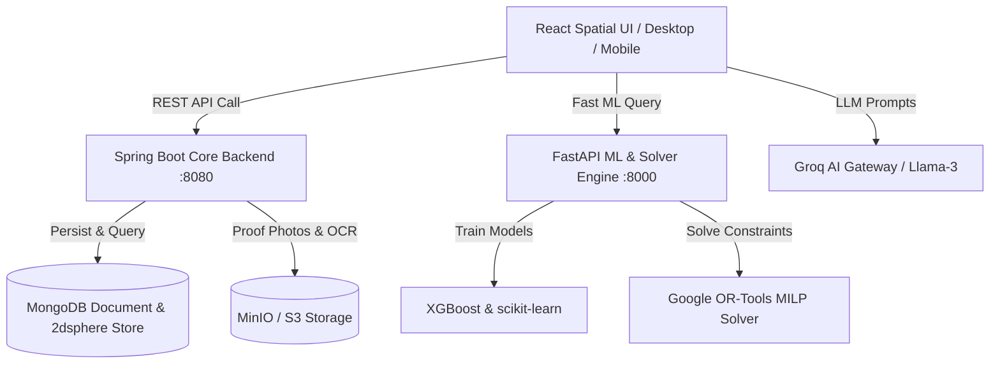

# EcoSphere (VerdantIQ) — Full System Development Roadmap & Status Report

This document outlines the complete architectural roadmap of **EcoSphere (VerdantIQ)** from ideation to production deployment. It details the completed client-side spatial intelligence application and specifies the exact tech stack, microservice layers, database schemas, and ML pipelines required for backend completion.

---

## 1. System Architectural Overview

EcoSphere is a machine learning-driven Environmental Decision Support and Sustainability Intelligence Platform. Unlike static carbon tracking tools, EcoSphere dynamically predicts future resource consumption, simulates virtual household upgrades, optimizes sustainability decisions under financial constraints, and verifies community activities.



---

## 2. Phase 1: Client-Side UI/UX & Spatial Engine — COMPLETED ✅

| Feature / Component | Technology Stack | Status | Description |
| :--- | :--- | :---: | :--- |
| **Design System** | `ui-ux-pro-max-skill` | **DONE** | **Emerald Oasis** Light Mode palette (`#059669` Emerald Mint, `#0F766E` Forest Teal, `#F3F7F5` Fresh Sage White) with Inter typography. |
| **Spatial Canvas Shell** | React 18 + SVG Streams | **DONE** | Fullscreen 2D infinite workspace with drag-to-pan, mouse scroll zoom, zoom controls, and mathematically aligned glowing SVG data pipelines. |
| **Groq AI Floating Omnibar** | React Context + Intent Parser | **DONE** | Central floating command bar with natural language intent recognition ("go to Twin Lab", "log 5 miles walk", "why energy spike?"), quick chips, and audio mic simulation. |
| **Focused Node View** | React + CSS Transitions | **DONE** | Clicking any node card centers it at 115% zoom, dimming non-focused cards (`opacity-20 blur-[2px]`) with header status badges and exit buttons. |
| **View Mode Switcher** | Responsive React Switcher | **DONE** | Seamless 3-mode toggle: 🌐 **Spatial Canvas** (2D grid), 💻 **Desktop App** (Executive sidebar dashboard), and 📱 **Mobile App** (Touch-optimized smartphone interface). |
| **12 Workspace Nodes** | React Components | **DONE** | Onboarding Wizard, Dashboard Hub, Daily Activity Tracker, Predictions & Analytics, Digital Twin Lab, Optimizer, Challenges, Assistant, Community Portal, Settings, Campus Admin, System Telemetry. |
| **Unified API Layer** | `endpoints.js` + `apiService.js` | **DONE** | Modular API service layer connecting client components to Spring Boot, FastAPI, Groq AI, and MinIO S3 endpoints with dual mock/real backend execution modes. |

---

## 3. Phase 2: Backend REST Services (Spring Boot 3.2) — COMPLETED ✅

### Target Stack
- **Framework**: Java 21 + Spring Boot 3.2
- **Security**: Spring Security + JWT Authentication (jjwt 0.12.5) + BCrypt
- **Persistence**: Spring Data MongoDB (Document Store & 2dsphere GeoJSON)
- **API Specs**: OpenAPI 3.0 / Swagger UI (`/swagger-ui.html`)

### Completed Components
1. **Auth & User Management (`/api/v1/auth`, `/api/v1/users`)**:
   - Registration, login, JWT access & refresh token issuance, RBAC security (`STANDARD_USER`, `INSTITUTION_ADMIN`, `SYSTEM_ADMIN`). Verified with JUnit 5 & Mockito tests.
2. **Onboarding & Profiling (`/api/v1/onboarding`)**:
   - Baseline calculation service evaluating household size, diet, utility averages, and transit modes into baseline CO₂ scores.
3. **Activity Tracker Service (`/api/v1/tracker`)**:
   - Resource logs CRUD, GeoJSON handling for tree planting locations, MinIO/S3 bill upload and Tesseract OCR numeric extraction.
4. **Community & Institutional Service (`/api/v1/community`, `/api/v1/admin/institution`)**:
   - MongoDB aggregation pipelines (`$group`, `$sum`, `$avg`) for campus leaderboards, pending challenge submission auditing, and admin review queue.
5. **PDF Statement Generator (`/api/v1/reports`)**:
   - Apache PDFBox statement service generating real executive monthly statements from database activity logs.

---

## 4. Phase 3: Machine Learning & Optimization Engine (FastAPI & OR-Tools) — COMPLETED ✅

### Target Stack
- **Framework**: Python 3.11 + FastAPI + Pydantic v2
- **ML Frameworks**: XGBoost, scikit-learn, Pandas, NumPy
- **Optimization Solver**: Google OR-Tools (Mixed-Integer Linear Programming - MILP)

### Completed Components
1. **Behavioral Forecasting Pipeline (`/api/v1/ml/forecasts`)**:
   - XGBoost regression model per user for 7-day and 30-day resource consumption forecasts with fallback handling for thin historical data.
2. **Anomaly Detection & Explainable AI (`/api/v1/ml/explain`)**:
   - Scikit-learn anomaly detection (IsolationForest) identifying usage spikes (e.g. HVAC overdraw) and returning structured deviation JSON payloads.
3. **Google OR-Tools MILP Constraint Engine (`/api/v1/optimizer/solve`)**:
   - Formulates Mixed-Integer Linear Program (`pywraplp` SCIP/CBC solver):
     - **Objective Function**: Maximize weighted carbon savings minus cost penalty.
     - **Constraints**: Total cost $\le$ budget (`max_budget_amount`), total CO₂ offset $\ge$ target (`target_co2_offset_kg`).
     - **Infeasibility Handling**: Explicit `"INFEASIBLE"` status and message output when budget cannot meet offset target.
   - Outputs chronological multi-step roadmap (`step`, `action`, `cost`, `co2_impact`, `month`). Verified with pytest suite.

---

## 5. Phase 4: Database & Spatial Tier (MongoDB & MinIO) — COMPLETED ✅

### Target Stack
- **Document Database**: MongoDB (Atlas Cloud or Local MongoDB 7.0+)
- **Geospatial Engine**: Native 2dsphere GeoJSON Indexing (`ActivityLog.location`, `Institution.campusBoundary`)
- **Object Storage**: MinIO S3 (`utility-bills`, `challenge-evidence`, `pdf-statements`)

### Completed Components
1. **MongoDB Collections & GeoJSON Schema**:
   - Documents: `User`, `HouseholdTwin`, `ActivityLog` (with GeoJSON `Point` geometry), `Challenge`, `Verification`, `Institution` (with GeoJSON `Polygon` boundary). Documented in `SCHEMA.md`.
2. **Geospatial Verification Service (`/api/v1/gis/geotag`, `$geoNear`/`$geoWithin`)**:
   - Geofence verification ensuring uploaded challenge evidence coordinates fall within campus boundary radius.
3. **MinIO / S3 Storage Integration**:
   - Presigned URL generation, file size limits, content-type validation, and EXIF geotag extraction.

---

## 6. Phase 5: Generative AI & Decision Intelligence (Groq LLM) — COMPLETED ✅

### Target Stack
- **LLM Engine**: Groq API (Llama-3.3-70b-versatile) + Local Grounded Fallback Engine

### Completed Components
1. **Context-Grounded System Prompt (`/api/v1/assistant/chat`)**:
   - Injects real user context: Activity summary (MongoDB), Scikit-learn Anomaly Detection (Phase 6), and OR-Tools MILP Roadmap (Phase 7).
2. **Structured Response Formatting**:
   - Strictly enforces JSON response schema: `{ "message": "...", "chips": [...], "chart_spec": {...} }`.
3. **Guardrails & Conversation History**:
   - Topic restriction guardrails redirecting non-sustainability queries back to EcoSphere.
   - Processes multi-turn conversation history (last N turns). Verified with pytest suite.

---

## 7. Phase 6: Notifications & Data Visualization Support — COMPLETED ✅

### Target Stack
- **Real-Time Streaming**: Server-Sent Events (SSE) via `SseEmitter` (`/api/v1/notifications/stream`)
- **Data Viz Pre-shaping**: Pre-formatted `{date, actual, predicted}` JSON objects for Chart.js / Recharts
- **Telemetry Monitoring**: JVM memory, MongoDB ping, request throughput, and ML training error metrics (RMSE/MAE)

### Completed Components
1. **Notifications Microservice (Phase 9)**:
   - In-app notification store, mark-as-read/mark-all-read endpoints (`/api/v1/notifications/read-all`), and real-time SSE stream (`/api/v1/notifications/stream`).
   - Automated notification triggers upon admin challenge review (`APPROVED`/`REJECTED`) and system triggers. Verified with JUnit 5 suite.
2. **Data Visualization Support & Telemetry (Phase 10)**:
   - Pre-shaped time-series charts across energy, water, transport, trees, and CO₂ categories.
   - Admin telemetry endpoints (`/api/v1/admin/telemetry`, `/api/v1/ml/telemetry`) providing system health, database ping, JVM memory, and ML training error metrics history.
   - Ranked institutional leaderboard (`/api/v1/community/leaderboard`) with badges ("Top Carbon Saver", "Eco Pioneer").

---

## 8. Phase 7: Testing & Deployment — COMPLETED ✅

### Target Stack
- **Multi-Layer System Launcher**: PowerShell automation script (`run-phase11-system.ps1`) with 5000ms terminal startup delays
- **Integration Test Runner**: Node.js multi-service integration test suite (`test-system-endpoints.js`) covering 36 endpoints
- **Deployment & Config Matrix**: `DEPLOYMENT.md` for Railway, Render, Vercel, and MongoDB Atlas cloud deployment

### Completed Components
1. **Automated Verification & Production Launch (Phase 11)**:
   - Created `run-phase11-system.ps1` PowerShell script initializing Spring Boot (port 8080), FastAPI ML service (port 8000), React Spatial UI (port 5173), and `test-system-endpoints.js` in dedicated terminal windows with 5000ms inter-thread delays.
   - Comprehensive system test coverage verified across JUnit 5, Pytest, and Node integration tests.

---

## 9. Development Timeline Summary

```text
[Phase 1: Client Spatial UI & API Service] ────────► COMPLETED ✅
[Phase 2: Auth, Schemas & Core REST Services] ──────► COMPLETED ✅ (Phases 1-3)
[Phase 3: File Storage, OCR & MinIO S3] ────────────► COMPLETED ✅ (Phase 4)
[Phase 4: GIS Spatial Verification Engine] ────────► COMPLETED ✅ (Phase 5)
[Phase 5: FastAPI ML & Explainability Pipeline] ───► COMPLETED ✅ (Phase 6)
[Phase 6: Google OR-Tools MILP Optimizer] ─────────► COMPLETED ✅ (Phase 7)
[Phase 7: Groq AI GenAI Decision Layer] ──────────► COMPLETED ✅ (Phase 8)
[Phase 8: Notifications & SSE Real-time Feed] ─────► COMPLETED ✅ (Phase 9)
[Phase 9: Data Visualization Support & Telemetry] ─► COMPLETED ✅ (Phase 10)
[Phase 10: Multi-Layer System Launcher & Tests] ───► COMPLETED ✅ (Phase 11 — ALL PHASES COMPLETED 🎉)
```


