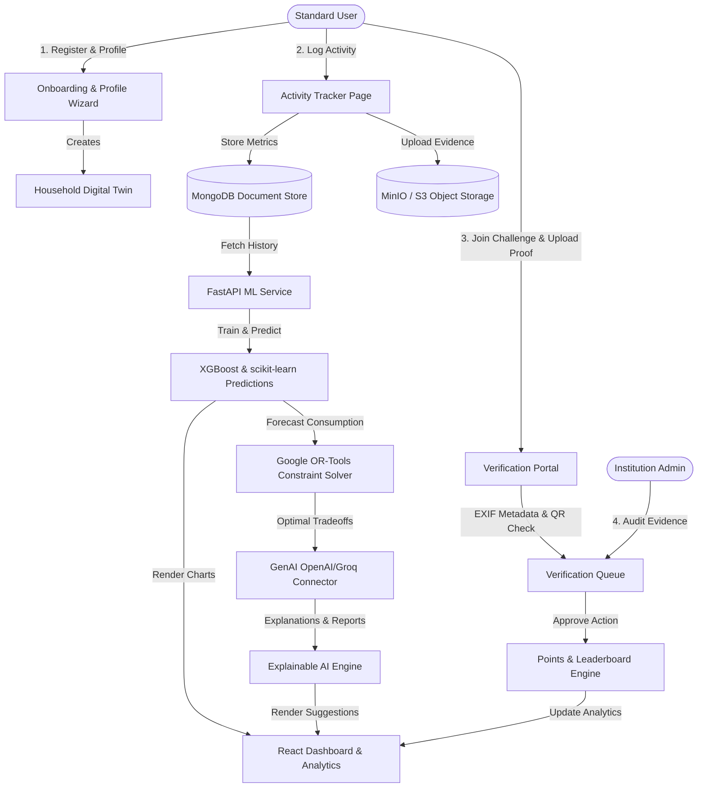

# EcoSphere — System Workflows and User Interface Specification

EcoSphere (VerdantIQ) is a machine learning-driven Environmental Decision Support and Sustainability Intelligence Platform. This document outlines the end-to-end operational workflows of the system and details the application's pages, features, interactive actions, and underlying system behaviors.

> [!NOTE]
> **Implementation Status (Phases 0–10 Completed ✅)**:
> All core workflows described below are backed by working microservice endpoints across Spring Boot (`:8080`), FastAPI (`:8000`), MongoDB 2dsphere, MinIO S3, Google OR-Tools MILP Solver, Groq LLM Gateway, real-time SSE notification stream (`/api/v1/notifications/stream`), and pre-shaped chart telemetry services.

---
 
## 1. System Roles and Access Control (Spring Security RBAC — Built ✅)

To support institutional, community, and individual usage, the system defines three primary roles:

| Role | Description | Access Level |
| :--- | :--- | :--- |
| **Standard User** | Individuals or households logging activities, using the digital twin, optimization engine, and participating in challenges. | Personal Dashboard, Trackers, Digital Twin, Optimizer, Chat Assistant, Challenges. |
| **Institution Admin** | Representatives of educational campuses, organizations, or residential societies managing group metrics. | Institutional Dashboard, Member Management, Campus Challenge Builder, Verification Queue. |
| **System Admin** | Global administrators maintaining system integrity and service health. | Global Settings, ML Model Telemetry, Database Config, Global Audit logs. |

---

## 2. End-to-End System Workflows

The following Mermaid diagram illustrates the data flow and step-by-step processes within the EcoSphere platform, starting from user input to ML/AI analysis and verification:

### Core Workflows Details

#### Workflow 1: User Onboarding and Digital Twin Initialization
1. The user registers an account and fills out an initial questionnaire (number of household members, appliances in use, standard commute modes, average utility bills).
2. The React client submits this payload to the Spring Boot REST API.
3. Spring Boot writes the profile details to MongoDB and initializes the baseline **Household Digital Twin** structure.
4. The system calculates an initial baseline carbon footprint score to serve as a benchmark.

#### Workflow 2: Daily Activity Tracking & Logging
1. The user navigates to the tracker and inputs resource usage (e.g., electricity kWh, transport mileage, water volume, waste weights).
2. The user can optionally upload an image (e.g., utility bill or waste segregation photo) to S3 (with file reference saved in MongoDB).
3. The React app performs client-side validation and dispatches the log to Spring Boot.
4. Spring Boot persists the log entry and triggers asynchronous analytics updates.

#### Workflow 3: Behavioral Pattern Learning & Forecasting (ML Pipeline)
1. Every evening, the FastAPI microservice runs background routines to analyze user logging patterns.
2. An XGBoost model trains on historical utility logs to forecast energy, water, and transport consumption for the upcoming week and month.
3. The output predictions are stored in MongoDB for fast retrieval times on the user dashboard.

#### Workflow 4: Sustainability Optimization & Simulation
1. The user navigates to the Optimizer page and sets optimization parameters (e.g., "Reduce carbon footprint by 15% under a budget of ₹1,500").
2. Spring Boot forwards these parameters along with predicted user habits to the FastAPI backend.
3. FastAPI invokes a Google OR-Tools constraint program to identify the mathematically optimal combination of sustainability actions (e.g., swapping to LEDs, reducing private commutes, implementing rainwater harvesting).
4. The generated recommendations are passed to the GenAI layer (OpenAI/Groq) to format them into natural, understandable guides.

#### Workflow 5: Eco Challenge Completion and Evidence Verification
1. The user joins a local sustainability challenge (e.g., "Cycle 15 km this week" or "Log 100% waste segregation").
2. Upon completing the challenge, the user uploads evidence (e.g., GPS track image, photos of segregated bins, or scans a location QR code).
3. The Spring Boot backend checks the uploaded file's EXIF metadata to verify matching geolocations (via MongoDB 2dsphere spatial index) and timestamps.
4. For community challenges, the evidence goes to the Institution Admin's verification queue. Once approved, rewards are disbursed and leaderboards update dynamically.

---

## 3. Application Page Specifications

Below is the detailed specification of all planned application pages, listing their features, interactive actions, and behind-the-scenes system behavior.

### Page 1: User Onboarding & Profiling Wizard (`/onboarding`)
*   **Purpose**: Guide new users through initial household baseline configuration.
*   **UI Components & Features**:
    *   Multi-step form wizard: Household Size, Housing Type, Appliance Matrix, Commute Patterns, Regional Utility Inputs.
    *   Dynamic Baseline Preview Card updating on the fly as selections change.
*   **Interactive Actions**:
    *   `Next / Previous`: Navigate form steps with validation.
    *   `Calculate Baseline`: Submits questionnaires to backend.
    *   `Submit`: Completes registration, redirects to dashboard.
*   **System Behavior (Under-the-Hood)**:
    *   Spring Boot receives profile questionnaire, parses parameters, and uses built-in conversion algorithms to compute initial footprint bounds.
    *   Creates a new household digital twin configuration record in MongoDB.

### Page 2: Personal Sustainability Dashboard (`/dashboard`)
*   **Purpose**: The central command center showing current sustainability status, quick logs, notifications, and AI assistant alerts.
*   **UI Components & Features**:
    *   Large, interactive central **Eco-Score Dial** indicating the user's weekly rating.
    *   **Resource Widgets** displaying real-time metrics for: Water, Electricity, Transport, Waste, and Rewards.
    *   **Risk Alerts Feed**: Live warnings about deteriorating sustainability habits (e.g., "Water usage is 20% higher than average this week").
    *   **Quick-Log Modal**: Pop-up card for immediate resource entry.
*   **Interactive Actions**:
    *   `Quick Log`: Opens the quick tracking modal.
    *   `Dismiss Alert`: Hides an alert, teaching the system user preference.
    *   `View Analytics`: Redirects the user to the details panel for that specific resource.
*   **System Behavior (Under-the-Hood)**:
    *   Fetches cached scores from MongoDB aggregation pipeline for optimal performance.
    *   Invokes the FastAPI recommendation ranker to prioritize tips shown in the dashboard sidebar based on user logs.

### Page 3: Daily Activity Tracker (`/tracker`)
*   **Purpose**: Allow manual data entry for all environmental actions and utility usage.
*   **UI Components & Features**:
    *   Categorized tabs: `[Transport]`, `[Electricity]`, `[Water]`, `[Waste]`, `[Tree Planting]`.
    *   Electricity/Water: Numerical inputs (kWh, gallons) or file upload area for utility bills.
    *   Transport: Commute mode selector, distance slider, and vehicle fuel type.
    *   Tree Planting: Geotagging button to drop GPS pins on trees planted.
*   **Interactive Actions**:
    *   `Upload Bill Document`: Extracts text using OCR APIs (or stores for admin auditing).
    *   `Fetch Current Location`: Requests browser location permission to pin coordinates.
    *   `Log Entry`: Submits form data to the backend.
*   **System Behavior (Under-the-Hood)**:
    *   Calculates carbon footprint additions on-the-fly based on conversion coefficients.
    *   Stores geolocations in MongoDB using GeoJSON 2dsphere geometry objects to support spatial queries.

### Page 4: Behavioral Predictions & Analytics (`/analytics`)
*   **Purpose**: Display ML-driven predictive dashboards and explainable resource forecasts.
*   **UI Components & Features**:
    *   **Interactive Forecast Graphs** (using Apache ECharts): Dotted line charts showing predicted usage vs. solid lines for actual past usage.
    *   **Trend Highlights**: Text cards summarizing behavioral predictions (e.g., "Electricity usage predicted to spike by 15% next weekend due to temperature patterns").
    *   **Explainable AI Section**: Generative explanations on why scores changed and what factors influenced predictions.
*   **Interactive Actions**:
    *   `Change Resource Filter`: Switch between Water, Energy, Transport, Waste forecasts.
    *   `Trigger Model Re-run`: Request fresh inference from FastAPI for real-time adjustments.
*   **System Behavior (Under-the-Hood)**:
    *   Queries FastAPI ML endpoint for prediction arrays.
    *   Calls Groq AI API to convert raw XGBoost anomaly flags into human-readable suggestions.

### Page 5: Household Digital Twin Simulation Lab (`/digital-twin`)
*   **Purpose**: Provide a virtual interactive model of the user's home to simulate the impact of sustainability upgrades before purchase.
*   **UI Components & Features**:
    *   3D / Iso-Style interactive house layout visualizer.
    *   **Upgrade Matrix**: Checkboxes for virtual upgrades (e.g., "Install Solar Panels", "Upgrade HVAC to Heat Pump", "Switch to LED Lighting", "Double-Glazed Windows").
    *   **Simulated Savings Counter**: Displays projected annual CO₂ reduction and monetary savings in real-time.
*   **Interactive Actions**:
    *   `Toggle Upgrade`: Dynamically recalculates digital twin baseline metrics.
    *   `Apply to Action Plan`: Transfers selected upgrades into the Google OR-Tools Optimizer.
*   **System Behavior (Under-the-Hood)**:
    *   Spring Boot retrieves digital twin parameters and sends simulation coefficients to FastAPI to re-evaluate household resource draw models.

### Page 6: Cross-Domain Decision Optimizer (`/optimizer`)
*   **Purpose**: Solve multi-objective constraint problems to help users achieve maximum environmental impact within a specific financial budget.
*   **UI Components & Features**:
    *   **Goal Configuration Panel**: Input fields for Target Carbon Offset (kg CO₂) and Maximum Budget ($ / ₹).
    *   **Priority Sliders**: Adjust relative weights (Cost Savings vs. Carbon Reduction vs. Effort Level).
    *   **Recommended Strategy Roadmap**: Chronological step-by-step action plan generated by Google OR-Tools.
*   **Interactive Actions**:
    *   `Solve Plan`: Sends user budget constraints to the FastAPI OR-Tools MILP solver.
    *   `Adopt Strategy`: Saves recommended actions into the user's active goals list.
*   **System Behavior (Under-the-Hood)**:
    *   FastAPI runs Mixed-Integer Linear Programming (MILP) algorithms to compute optimal decision tradeoffs.

### Page 7: Community & Institutional Portal (`/community`)
*   **Purpose**: Enable campus/institutional environmental collaboration, public leaderboards, and group pledges.
*   **UI Components & Features**:
    *   **Institution Selector**: Dropdown to view data for specific universities, corporate offices, or city zones.
    *   **Aggregate Impact Metrics**: Total CO₂ saved by community, trees planted, and water conserved.
    *   **Available Challenges**: Grid of active cards (e.g., "Commute green for 5 consecutive days").
    *   **Individual & Group Leaderboards**: Ranks users and institutions based on points.
    *   **Verification Upload Console**: Form to select the challenge, input notes, upload image, or scan a location QR code.
*   **Interactive Actions**:
    *   `Join Challenge`: Opts into a challenge.
    *   `Scan QR Code`: Opens the device camera to read validation QRs at official eco-stations.
    *   `Upload Evidence`: Submits files and triggers EXIF analysis.
*   **System Behavior (Under-the-Hood)**:
    *   Spring Boot reads the uploaded image's EXIF data to verify that the timestamp and location match the challenge criteria.
    *   For institution-only challenges, it pushes the verification request into the queue of the Institution Admin.
    *   Distributes points and updates MongoDB leaderboard collections upon approval.

### Page 8: AI Environmental Decision Assistant (`/assistant`)
*   **Purpose**: Provide a conversational chatbot that assists with sustainability decisions and explains environmental impacts.
*   **UI Components & Features**:
    *   Standard messaging panel with prompt bubbles.
    *   **Quick Query Chips**: One-click queries like "Which plastics can I recycle?", "Compare bicycle vs. train commute footprint for 20km".
    *   **Inline Chart Previews**: Renders charts directly within the chat window when explaining predictions.
*   **Interactive Actions**:
### Page 9: Community & Institutional Portal (`/community`)
*   **Purpose**: Provide transparency, reports, and rankings for organizations like universities or corporations.
*   **UI Components & Features**:
    *   **Institution Dashboard**: Displays campus-wide metrics (Total CO₂ avoided, trees planted, water recycled).
    *   **Campus-Wide Goals Tracker**: Shows progress towards institutional goals (e.g., "Reduce campus electricity by 10% by September").
    *   **Community Forums**: Discussion cards containing local sustainability ideas and events.
*   **Interactive Actions**:
    *   `Pledge Action`: Joins a community green pledge.
    *   `Create Event Listing`: Allows community members to submit clean-up or planting drives.
*   **System Behavior (Under-the-Hood)**:
    *   Spring Boot executes database aggregation queries (`SUM`, `AVG` grouped by institution ID) to supply real-time aggregated metrics.

---

### Page 10: Reports & Settings (`/settings`)
*   **Purpose**: Manage user details, configure target sustainability goals, and export PDF reports.
*   **UI Components & Features**:
    *   Form fields for password changes, profile data, and notifications setup.
    *   **Goal Planner Dashboard**: Interactive milestones editor.
    *   **Reports Hub**: List of past monthly sustainability reports.
*   **Interactive Actions**:
    *   `Save Settings`: Saves profile data.
    *   `Update Milestones`: Modifies monthly target savings.
    *   `Download PDF Report`: Triggers generation and download of a PDF statement.
*   **System Behavior (Under-the-Hood)**:
    *   `Download PDF Report` triggers Spring Boot's Apache PDFBox service, which aggregates historical data, ML prediction metrics, and AI-generated summaries into a highly formatted, print-ready PDF document stored temporarily in MinIO/S3.

---

### Page 11: Institution Admin Dashboard (`/admin/institution`)
*   **Purpose**: Allow institution admins to monitor campus-wide behavior, manage challenges, and audit user evidence.
*   **UI Components & Features**:
    *   **Members Directory**: List of registered users under this institution.
    *   **Auditing Desk**: Cards representing pending challenge submissions requiring manual review.
    *   **Challenge Creator Form**: Input panels to define a challenge name, duration, description, points reward, and verification rules (e.g., GPS metadata required, image required).
*   **Interactive Actions**:
    *   `Approve / Reject Evidence`: Validates user evidence submissions.
    *   `Launch Campus Challenge`: Saves and publishes a challenge to the campus portal.
    *   `Generate ESG Report`: Compiles organizational metrics into audit logs.
*   **System Behavior (Under-the-Hood)**:
    *   Spring Boot handles multi-tenant access checks to ensure an admin can only see or edit members and logs belonging to their own organization.

---

### Page 12: System Admin Console (`/admin/system`)
*   **Purpose**: Oversee global system configuration, model performance, and API consumption logs.
*   **UI Components & Features**:
    *   **System Health Telemetry**: CPU, memory, database connection pools, MongoDB latency statistics.
    *   **ML Model Telemetry Panel**: Lists scikit-learn and XGBoost model version statistics, average error rates, and last retraining times.
    *   **Global Variables Editor**: Editable matrix of environmental coefficients (e.g., kg of CO₂ per kWh of grid energy, per liter of gas, etc.).
*   **Interactive Actions**:
    *   `Trigger Model Re-training`: Forces FastAPI to fetch updated user history and run retraining routines.
    *   `Update Emission Factors`: Edits conversion parameters and updates MongoDB document coefficients to recalculate carbon metrics.
*   **System Behavior (Under-the-Hood)**:
    *   Spring Boot calls scheduler jobs or sends asynchronous commands via FastAPI REST API to start model training operations.

---

## 4. Design System & Premium Color Palette

To deliver a premium, state-of-the-art visual experience, EcoSphere adopts a modern, nature-inspired tech aesthetic. Below is the curated color palette using TailwindCSS configurations, HEX values, and HSL tokens.

### Theme: "Emerald Oasis" (Premium Light Mode Primary)

| Color Role | Color Name | Hex Code | HSL Value | Visual Representation & Primary Use Case |
| :--- | :--- | :--- | :--- | :--- |
| **Primary Accent** | Emerald Mint | `#059669` | `hsl(162, 93%, 30%)` | Main highlights, carbon scores, success badges, primary action buttons, active navigation states. |
| **Secondary Accent**| Forest Teal | `#0F766E` | `hsl(175, 77%, 26%)` | Navigation sidebars, section headers, secondary actions, chart graphics. |
| **Main Background** | Fresh Sage White | `#F3F7F5` | `hsl(150, 12%, 96%)` | Soft, low-strain sage-tinted off-white background canvas. |
| **Surface Card** | Pure Alabaster | `#FFFFFF` | `hsl(0, 0%, 100%)` | Dialog overlays, widgets, popup logging cards, with drop-shadow overlays. |
| **Text Primary** | Deep Charcoal | `#0F172A` | `hsl(222, 47%, 11%)` | Main headers, numeric stats, primary labels. |
| **Text Secondary** | Slate Gray | `#475569` | `hsl(215, 16%, 35%)` | Subtext, unit annotations (e.g., "kg CO₂"), time labels, inactive states. |
| **Alert / Warning** | Amber Sun | `#D97706` | `hsl(35, 92%, 44%)` | Moderate footprint warnings, upcoming goal deadlines. |
| **Alert / Danger** | Crimson Red | `#DC2626` | `hsl(0, 72%, 51%)` | Critical carbon footprint spikes, failed challenges, high-waste notifications. |
| **Alert / Success**| Lime Forest | `#4D7C0F` | `hsl(84, 80%, 27%)` | Completed challenges, met goals, reward notifications. |
