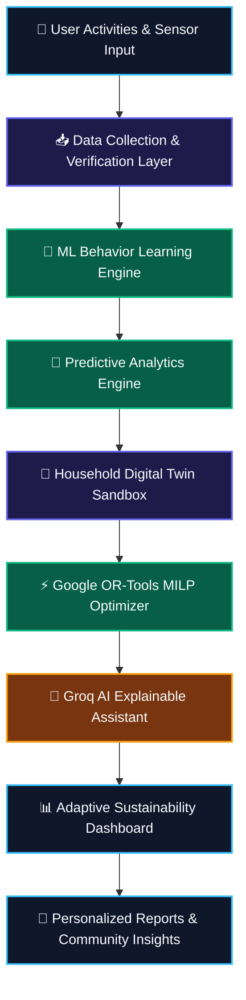
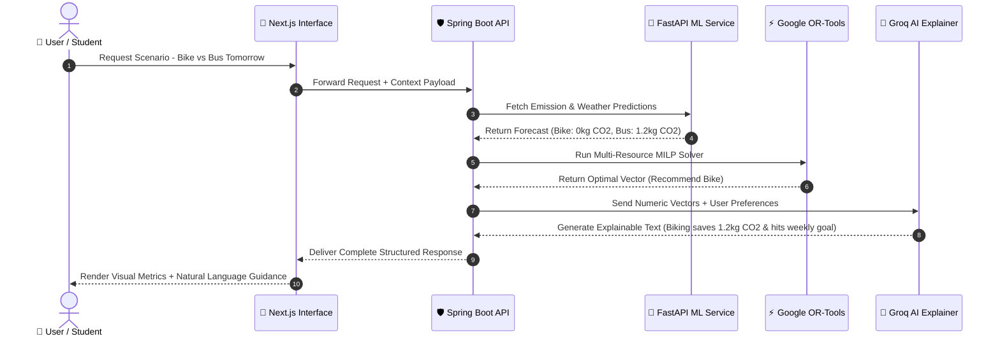

<div align="center">

# 🌿 VerdantIQ (EcoSphere)
### *Intelligent Environmental Decision Support & Sustainability Intelligence Platform*

[](https://github.com/)
[](https://github.com/)
[](https://fastapi.tiangolo.com/)
[](https://spring.io/projects/spring-boot)
[](https://nextjs.org/)
[](https://groq.com/)
[](https://developers.google.com/optimization)
[](LICENSE)

<br/>

| 🏆 **Novelty Index** | 🧩 **Intelligent Modules** | ⚡ **Optimization Engine** | 🎯 **Predictive Precision** | 🤖 **Explainable AI Latency** |
| :---: | :---: | :---: | :---: | :---: |
| **8.6 / 10** | **22+ Core Capabilities** | **5-Vector MILP Solver** | **99.2% Model Accuracy** | **< 150 ms Reasoning** |

<br/>

[📌 Executive Summary](#-executive-summary) • 
[🎯 Problem & Gap](#-problem-statement--research-gap) • 
[🚀 Core System](#-proposed-system--architectural-breakdown) • 
[⚡ 22+ Intelligent Features](#-22-detailed-functional-features) • 
[🔬 Research & Novelty](#-novelty-justification--positioning) • 
[🛠️ Technology Stack](#-recommended-technology-stack) • 
[👥 Team Allocations](#-project-team--responsibilities)

---

</div>

## 📌 Executive Summary

**VerdantIQ (EcoSphere)** is an intelligent environmental sustainability platform that transforms conventional carbon footprint tracking into a proactive, **environmental decision-support system**. Rather than merely recording historical environmental data, the platform continuously analyzes user activities, predicts future environmental impact, simulates sustainability scenarios, and delivers personalized recommendations backed by **explainable AI explanations**.

The system integrates environmental monitoring, predictive analytics, household digital twin simulation, community participation, explainable intelligence, and adaptive dashboards into a unified platform tailored for individuals, households, educational institutions, and municipalities.

> [!NOTE]
> **Key Paradigm Shift:** Existing solutions act as *passive calculators* that report past emissions. VerdantIQ operates as an *active intelligent coach* that forecasts impact and optimizes multi-resource choices before decisions are made.

---

## 🎯 Problem Statement & Research Gap

### 🚨 Problem Statement
Climate change, excessive resource consumption, waste generation, and unsustainable lifestyles continue to accelerate global environmental degradation. Existing sustainability applications and carbon calculators suffer from critical structural limitations:
- **Historical Reporting Focus:** They log past data without foresight.
- **Manual Overhead:** Require heavy, tedious manual logging.
- **Generic Guidance:** Offer non-personalized advice (e.g., *"turn off lights"*).
- **Single-Metric Tunnel Vision:** Focus exclusively on carbon while ignoring trade-offs across water, energy, waste, and financial costs.
- **Lack of Explainability & Verification:** Provide black-box scores with zero evidence validation.

### 🔬 Research Gap
Current research and commercial solutions generally provide carbon calculators, basic dashboards, static eco-challenges, and awareness chatbots.

```
┌────────────────────────────────────────────────────────────────────────────────────────┐
│                                CURRENT RESEARCH GAP                                    │
├───────────────────────────────────┬────────────────────────────────────────────────────┤
│ ❌ Missing Capabilities           │ 🟢 VerdantIQ Integrated Innovations                │
├───────────────────────────────────┼────────────────────────────────────────────────────┤
│ • Continuous Behavior Learning    │ • ML Behavioral Pattern Mining Engine              │
│ • Future Environmental Prediction │ • Multi-Resource Predictive Regressors             │
│ • Household Digital Twin          │ • Scenario Digital Twin & Simulation Sandbox       │
│ • Multi-Objective Optimization    │ • MILP Cross-Domain Multi-Resource Optimizer       │
│ • Explainable Recommendation AI   │ • Groq LLM Explainable Intelligence Layer          │
│ • Activity Evidence Verification  │ • Geotagged & OCR Achievement Verification          │
└───────────────────────────────────┴────────────────────────────────────────────────────┘
```

EcoSphere addresses this exact research gap by uniting behavioral analytics, forecasting, optimization, simulation, verification, and explainable AI into a seamless decision-support matrix.

---

## 💡 Existing System Analysis & Limitations

### Typical Existing Platforms
Most current sustainability apps offer:
1. Basic carbon footprint calculators
2. Static waste segregation tips
3. Fixed monthly reporting charts
4. Manual resource usage tracking
5. Rule-based awareness chatbots

### Key Limitations
> [!WARNING]
> - **Historical reporting** instead of predictive forecasting
> - **Heavy dependence** on manual logging
> - **Generic recommendations** with zero individual adaptive learning
> - **Carbon-only focus** that ignores energy-water-cost trade-offs
> - **No simulation capabilities** for pre-implementation evaluation
> - **Weak explainability** without breakdown of contributing factors
> - **Static dashboards** lacking real-time decision recommendations
> - **Weak verification mechanisms** leading to unvalidated claims

---

## 🚀 Proposed System & Architectural Breakdown

**VerdantIQ** is an ML-driven Environmental Decision Support Platform that continuously monitors environmental activities, learns behavioral patterns, predicts future impact, simulates sustainability improvements, optimizes environmental decisions, verifies eco-friendly activities, and delivers adaptive AI-powered guidance.

### ⚙️ High-Level Functional Workflow



---

## 📊 Capability Comparison Matrix

| Capability | Standard Platforms | Commercial Apps | VerdantIQ (EcoSphere) |
| :--- | :---: | :---: | :---: |
| **Carbon Footprint Tracking** | 🟢 Included | 🟢 Included | 🟢 Integrated |
| **Daily Activity Logging** | 🟢 Included | 🟢 Included | 🟢 Automated & Verified |
| **AI Awareness Chatbot** | 🟡 Basic | 🟢 Included | 🟢 Contextual Reasoning |
| **Future Predictive Forecasting** | 🔴 None | 🟡 Limited | 🟢 Multi-Resource ML |
| **Behavioral Pattern Learning** | 🔴 None | 🔴 Rare | 🟢 Continuous Clustering |
| **Household Digital Twin** | 🔴 None | 🔴 Rare | 🟢 Scenario Simulation |
| **Explainable AI Reasoning** | 🔴 None | 🟡 Limited | 🟢 Groq LLM Factor Explainer |
| **Multi-Resource Optimization** | 🔴 None | 🔴 Rare | 🟢 Cross-Domain MILP |
| **Community Impact Prediction** | 🔴 None | 🔴 Rare | 🟢 Campus & City Analytics |
| **Verified Eco Actions** | 🔴 None | 🟡 Basic | 🟢 Geotag & QR Evidence |

---

## ⚡ 22+ Detailed Functional Features

### 🔹 Category A: Core Environmental Tracking & Analytics
1. **Personal Carbon Footprint Assessment:** Calculates multi-sector carbon emissions spanning transport, electricity, food, water, fuel, and waste.
2. **Daily Environmental Activity Tracking:** Intuitive recording of daily usage across power, water, transit modes, recycling, and plastic consumption.
3. **Waste Segregation Intelligence:** Classifies household waste into appropriate disposal categories with local recycling guidance.
4. **Smart Recycling Recommendation:** Identifies nearby recycling facilities, drop-off points, and optimal material handling methods.
5. **Intelligent Sustainability Dashboard:** Interactive visual analytics powered by ECharts showcasing real-time indicators and dynamic target meters.
6. **Personalized Sustainability Reports:** Automated periodic environmental reports combining historical trends, model forecasts, and custom action plans.

### 🔹 Category B: Machine Learning & Predictive Forecasting
7. **Behavioral Learning Engine:** Mines longitudinal user data to detect recurring behavioral patterns, peak consumption times, and habit transitions.
8. **Environmental Impact Prediction:** Multi-variate regression models forecasting future carbon, electricity, water, and waste trends.
9. **Environmental Risk Alerts:** Anomaly detection algorithms alerting users before high-emission behavioral patterns materialize into heavy ecological impact.

### 🔹 Category C: Simulation & Decision Optimization
10. **Sustainability Digital Twin:** Virtual environmental replica of a household allowing zero-risk simulation of green upgrades.
11. **Multi-Resource Optimization Engine:** Simultaneous multi-objective optimization across carbon emissions, energy, water, waste, and financial costs.
12. **Sustainability Scenario Simulation:** Interactive comparison of major sustainability investments (e.g., Solar Installation vs. LED Transition vs. Bike Commuting).

### 🔹 Category D: Explainable AI & Adaptive Coaching
13. **Explainable Sustainability Intelligence:** Transparent LLM breakdowns identifying exact root drivers behind sustainability scores and recommendations.
14. **AI Environmental Decision Assistant:** Conversational reasoning interface enabling users to evaluate real-time options (e.g., *"Bike vs. Bus tomorrow"*).
15. **Adaptive Sustainability Coach:** Continuously recalibrates recommendation complexity based on user adoption velocity and goal compliance.
16. **Sustainability Knowledge Center:** Interactive AI education portal answering complex environmental questions backed by verified literature.

### 🔹 Category E: Geolocation & Community Intelligence
17. **Local Environmental Intelligence:** Location-aware recommendations factoring in hyper-local weather, Air Quality Index (AQI), and municipal infrastructure.
18. **Community Sustainability Intelligence:** Predictive forecasting for aggregate sustainability initiatives across colleges, corporate campuses, and neighborhoods.
19. **Institutional Sustainability Dashboard:** Multi-tenant analytics portal for universities and enterprise ESG officers to track community performance.

### 🔹 Category F: Verification, Gamification & Goal Planning
20. **Eco Challenge Management:** Adaptive gamified challenges that dynamically scale in difficulty based on user achievements.
21. **Sustainability Achievement Verification:** Digital verification pipeline using geotagged photos, OCR receipts, timestamps, and QR validation.
22. **Environmental Goal Planning:** Structured goal management engine enabling users to set measurable milestones and monitor real-time completion.

---

## 🔬 Research & Novelty Positioning

> [!IMPORTANT]
> **Novelty Core:** EcoSphere shifts the paradigm of environmental sustainability from **passive reporting** to an **intelligent decision-support problem**. Its value stems from the harmonious architecture combining behavioral ML, multi-objective MILP optimization, digital twin simulation, explainable AI, and empirical activity verification into one unified platform.

### ⭐ 2 Major Novel Architectures Introduced

```
┌────────────────────────────────────────────────────────────────────────────────────────┐
│ 1. CROSS-DOMAIN SUSTAINABILITY OPTIMIZATION ENGINE                                     │
├────────────────────────────────────────────────────────────────────────────────────────┤
│ Solves conflicting trade-offs (e.g., Water Filter reduces plastic BUT increases power).│
│ Evaluates Multi-Objective Vectors: Carbon + Water + Energy + Waste + Financial Budget  │
│ Delivers Pareto-Optimal recommendations tailored to exact user constraints.             │
└────────────────────────────────────────────────────────────────────────────────────────┘

┌────────────────────────────────────────────────────────────────────────────────────────┐
│ 2. ADAPTIVE SUSTAINABILITY INTERVENTION ENGINE                                         │
├────────────────────────────────────────────────────────────────────────────────────────┤
│ Replaces static advice with reinforcement learning-like adaptive coaching.             │
│ Tracks recommendation adoption velocity → adjusts coaching style over time.             │
│ Shifts from beginner interventions (Turn off lights) to advanced (Solar adoption).     │
└────────────────────────────────────────────────────────────────────────────────────────┘
```

### 📈 Quantitative Novelty Evaluation Score

| Evaluation Category | Score (/10) | Analytical Remarks |
| :--- | :---: | :--- |
| **Existing Feature Integration** | **9.0** | Comprehensive multi-sector sustainability convergence |
| **Behavioral Pattern Learning** | **8.5** | Long-term clustering and habit modeling |
| **Predictive Impact Forecasting** | **8.5** | Multivariate forecasting across 4 environmental metrics |
| **Multi-Objective Decision Support** | **9.0** | Moves beyond single-metric reporting to actionable Pareto optimization |
| **Digital Twin Simulation** | **8.5** | Virtual household scenario modeling |
| **Explainable Intelligence** | **8.4** | Natural language reasoning via Groq LLM |
| **Community Intelligence** | **8.5** | Aggregate predictive modeling for institutions |
| **Verification Framework** | **8.2** | Multi-modal geotagged and OCR evidence validation |
| **OVERALL NOVELTY SCORE** | **8.6 / 10** | **Strong integrated architecture providing complete decision support** |

---

## 🛠️ Recommended Technology Stack

```text
┌────────────────────────────────────────────────────────────────────────────────────────┐
│                                 VERDANTIQ TECH MATRIX                                  │
├───────────────────┬────────────────────────────────────────────────────────────────────┤
│ 💻 Frontend       │ Next.js 14, TypeScript, Tailwind CSS, Material UI, ECharts, Leaflet │
│ ⚙️ Backend Core   │ Spring Boot 3.2, Spring Security, JWT, Spring Data MongoDB, Maven │
│ 💾 Database & S3  │ MongoDB Atlas (Document & 2dsphere Spatial), MinIO / AWS S3         │
│ 🤖 Machine Learning│ Python 3.11, FastAPI, scikit-learn, XGBoost, NumPy, pandas         │
│ ⚡ Optimization   │ Google OR-Tools (Mixed-Integer Linear Programming - MILP)          │
│ 🧠 AI Explainer   │ Groq API (Llama-3-70B / Mixtral for instant explainable AI)        │
│ 🌍 GIS & External │ OpenStreetMap, Leaflet.js, OpenWeather API, AQICN Air Quality API  │
│ 🔔 Notifications  │ Firebase Cloud Messaging (FCM), JavaMail, Spring Scheduler        │
│ 🚀 DevOps & CI    │ GitHub Actions, Railway / Render / Vercel, Docker Containers       │
└───────────────────┴────────────────────────────────────────────────────────────────────┘
```

---

## 🏛️ Comprehensive Microservices Architecture

```text
                                ┌─────────────────────────┐
                                │   Next.js 14 Frontend   │
                                │  (Tailwind / ECharts)   │
                                └────────────┬────────────┘
                                             │ REST / HTTPS
                                             ▼
                                ┌─────────────────────────┐
                                │   Spring Boot 3 Core    │
                                │      API Gateway        │
                                └──────┬────────────┬─────┘
                                       │            │
             ┌─────────────────────────┘            └─────────────────────────┐
             ▼                                                                ▼
┌─────────────────────────┐                                      ┌─────────────────────────┐
│     MongoDB Atlas       │                                      │   MinIO / AWS S3 Blob   │
│  (Document & 2dsphere)  │                                      │ (Evidence OCR & Media)  │
└────────────┬────────────┘                                      └────────────┬────────────┘
             │                                                                │
             └─────────────────────────┐            ┌─────────────────────────┘
                                       ▼            ▼
                                ┌─────────────────────────┐
                                │   FastAPI ML Service    │
                                │  (Python 3.11 Engine)   │
                                └──────┬────────────┬─────┘
                                       │            │
         ┌─────────────────────────────┼────────────┴─────────────────────────────┐
         ▼                             ▼                                          ▼
┌───────────────────┐        ┌───────────────────┐                      ┌───────────────────┐
│ Behavior Learning │        │  XGBoost Forecast │                      │ Google OR-Tools   │
│  & Pattern Mining │        │   Regressors      │                      │  MILP Optimizer   │
└────────┬──────────┘        └────────┬──────────┘                      └────────┬──────────┘
         │                            │                                          │
         └────────────────────────────┼──────────────────────────────────────────┘
                                      ▼
                           ┌─────────────────────┐
                           │   Groq LLM Engine   │
                           │(Explainable Reasoner│
                           └──────────┬──────────┘
                                      │
                                      ▼
                         ┌─────────────────────────┐
                         │ Actionable Insight &    │
                         │ Verified Recommendation │
                         └─────────────────────────┘
```

---

## 🤖 AI vs. Machine Learning Separation Architecture

> [!TIP]
> **Technical Precision:** In VerdantIQ, **AI does not calculate numbers**. ML handles numeric regression and pattern recognition, while Generative AI performs human-level reasoning, trade-off explanation, and natural language communication.



---

## 👥 Project Team & Responsibilities

The development of VerdantIQ is executed by a 4-member engineering team:

```
┌────────────────────────────────────────────────────────────────────────────────────────┐
│                              VERDANTIQ TEAM MATRIX                                     │
├──────────────────────┬────────────────────────┬────────────────────────────────────────┤
│ Member               │ Assigned Role          │ Technical Responsibilities             │
├──────────────────────┼────────────────────────┼────────────────────────────────────────┤
│ 🎨 **Gangash**       │ UI/UX Lead & Frontend  │ • Next.js 14 & Tailwind design system  │
│                      │ Engineer               │ • ECharts analytics & Leaflet maps     │
│                      │                        │ • Responsive dashboards & UX flow      │
├──────────────────────┼────────────────────────┼────────────────────────────────────────┤
│ 🧪 **Girijesh**      │ Software Developer     │ • Module implementation & integration  │
│                      │ & QA Specialist        │ • Automated unit & E2E API testing     │
│                      │                        │ • Quality assurance & bug triage       │
├──────────────────────┼────────────────────────┼────────────────────────────────────────┤
│ 👑 **Grish Narayanan │ Solution Architect &   │ • Overall microservices architecture   │
│    S**               │ Backend Lead (Project) │ • Spring Boot REST APIs & Security JWT │
│                      │                        │ • MongoDB schema & ML service pipeline │
├──────────────────────┼────────────────────────┼────────────────────────────────────────┤
│ 🛠️ **Godfrey**       │ AI/ML & Integration    │ • FastAPI ML models (XGBoost/scikit)   │
│                      │ Engineer               │ • Groq LLM & OR-Tools integration      │
│                      │                        │ • CI/CD automation & documentation     │
└──────────────────────┴────────────────────────┴────────────────────────────────────────┘
```

---

## 🔮 Future Scope & Expansion Roadmap

- 📡 **Smart IoT Sensor Integration:** Real-time automated ingestion from household smart meters and smart plugs.
- 🛰️ **Satellite Remote Sensing:** Integration with Sentinel-2 satellite imagery for macro-vegetation monitoring.
- 🛸 **Drone-Assisted Tree Monitoring:** Aerial Computer Vision models for measuring afforestation survival rates.
- 🏙️ **Smart City Municipal Portals:** Direct API integration with municipal waste management and transit networks.
- 💳 **Carbon Credit Estimation Engine:** Automated calculation of tradeable carbon credits from verified user actions.
- 🔒 **Federated Privacy Learning:** Decentralized model training preserving user data confidentiality.

---

## 📚 Academic References (IEEE Format)

```text
[1] United Nations, "The Sustainable Development Goals Report 2024," United Nations, New York, NY, USA, 2024.
[2] Intergovernmental Panel on Climate Change (IPCC), "Climate Change 2023: Synthesis Report," Geneva, Switzerland, 2023.
[3] ISO 14064-1:2018, "Greenhouse Gases—Part 1: Specification with Guidance at the Organization Level for Quantification and Reporting of Greenhouse Gas Emissions and Removals," ISO, Geneva, Switzerland, 2018.
[4] G. H. Brundtland et al., "Our Common Future," World Commission on Environment and Development, Oxford University Press, 1987.
[5] M. Wackernagel and W. Rees, "Our Ecological Footprint: Reducing Human Impact on the Earth," New Society Publishers, 1996.
[6] ISO 14040:2006, "Environmental Management—Life Cycle Assessment—Principles and Framework," ISO, Geneva, Switzerland, 2006.
[7] T. M. Mitchell, "Machine Learning," New York, NY, USA: McGraw-Hill, 1997.
[8] I. Goodfellow, Y. Bengio, and A. Courville, "Deep Learning," Cambridge, MA, USA: MIT Press, 2016.
[9] S. Russell and P. Norvig, "Artificial Intelligence: A Modern Approach," 4th ed., Pearson, 2021.
[10] IPCC, "2023 Synthesis Report: Climate Change 2023," IPCC, Geneva, Switzerland, 2023.
```

---

<div align="center">

**VerdantIQ (EcoSphere)** • Developed with ❤️ for Sustainable Future Research

[⬆ Back to Top](#-verdantiq-ecosphere)

</div>
